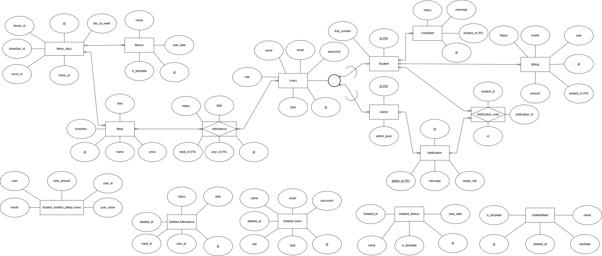
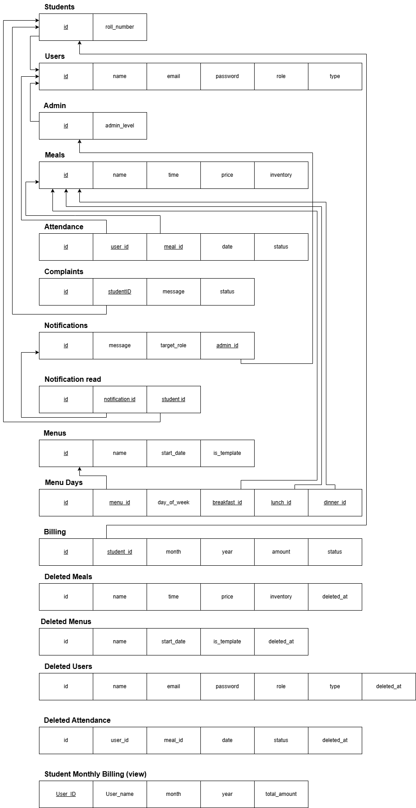

# Mess Management System

A comprehensive web-based mess Management System developed using Flask. 
This project streamlines mess operations, including user management, meal planning, billing, 
complaints, notifications, attendance, and data backup. It is designed for educational use.

---

## Features

- **User Authentication:** Secure login and role-based access for admins, students, and staff.
- **Meal Management:** Menu planning, meal attendance, and feedback.
- **Billing System:** Automated billing, payment tracking, and invoice generation.
- **Complaint Handling:** Register, track, and resolve complaints efficiently.
- **Notifications:** Send important updates and reminders to users.
- **Attendance Tracking:** Record and monitor student attendance.
- **Data Backup:** Manage deleted records and backup critical data.
- **Responsive UI:** Clean and user-friendly interface.

---

## Project Structure

```
.
├── app.py
├── database/
├── routes/
├── services/
├── static/
│   ├── ERdiagram.png
│   ├── Schema.png
│   └── styles.css
├── templates/
├── utils/
├── requirements.txt
└── ...
```

---

## Database Design

### Entity-Relationship Diagram



### Database Schema



---

## Getting Started

### Prerequisites

- Python 3.8+
- pip

### Installation

1. **Clone the repository:**
   ```sh
   git clone <repository-url>
   cd <project-directory>
   ```

2. **Install dependencies:**
   ```sh
   pip install -r requirements.txt
   ```

3. **Configure the database:**
   - Edit `db_config.ini` with your database credentials and settings.

4. **Initialize the database:**
   - Run the provided scripts in the `database/` folder to set up tables and seed data.

5. **Run the application:**
   ```sh
   python app.py
   ```

6. **Access the system:**
   - Open your browser and go to `http://localhost:5000`

---

## Contributing

Contributions are welcome! Please fork the repository and submit a pull request.

---

## License

This project is licensed under the MIT License. See [LICENSE](LICENSE) for more information.
